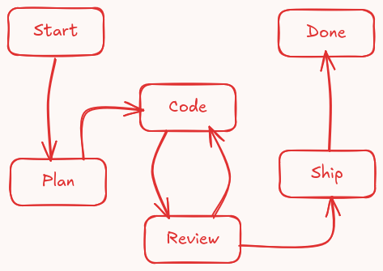

# Piflux

This package implements a coding workflow for [Pi Coding Agent](https://pi.dev). This workflow presumes a human in the loop.

## Why?

Pi's selling point to me was the idea of a minimalistic agent harness that I could adapt to my workflows, by having it customize itself to my needs. I created this mostly for myself, and made it public in case others find it useful.

I like to work collaboratively with AI. Sometimes I use agents as a code assistant when I am the one implementing. Other times agents are implementing under my oversight. This workflow is for the latter; I envisioned a simple process leveraging Pi's flexibility in managing sessions:



## How does it work?

Each step in the diagram above happens in a new session. That session has only the context it needs to work, and no context beyond that. This brings some benefits:

- Reduced token usage: A coding session does not need the planning conversation where ideas were still in a state of flux; a reviewing session does not need the intermediate steps that happened in the coding session.
- Improved implementation quality: As a consequence of the previous point, the implementation tends to be more focused and concise; of course this is nothing new, a separation of planning and implementation has been used in AI-assisted programming for a while. This extension leverages Pi's session management capabilities to make this process as simple and concise as possible, while extending this philosophy for AI reviews as well.
- Multiple models: Each step can be configured to a different model; I find that different models have different blind spots and different ways to solve problems. This, too, is something this workflow streamlines.

## Usage

The workflow provides a set of commands that are expected to be used in order:

### 1. `/start <branch-name>`

Creates a new branch for the workflow. The workflow ends with this branch being merged back into the base branch or abandoned.

### 2. `/plan <description>`

Creates a new planning session for the workflow. Description is optional, and is meant to be a brief description to initiate the planning work. Keep it to one line, more complex instructions can be provided in follow-up messages.

The purpose of planning is to nail down requirements, guardrails, and scope of the change to be implemented. The result of a planning session is a planning artifact with detailed implementation instructions that serves as input for later steps.

### 3. `/code`

Creates a new coding session for the workflow. The coding session reads the planning artifact and makes changes to the codebase. The plan may be deviated from (as is the nature of software development), and if necessary the user can provide further guidance in follow-up messages. The result of a coding session is unstaged changes and a coding report artifact.

### 4. `/review`

Creates a new reviewing session for the workflow. The reviewing session takes as input the planning artifact, the coding report, and the code changes retrieved from `git` in order to review the code changes based on the following criteria:
- Correctness: Whether the code does what it is supposed to do.
- Suitability: How well the code fits the plan it is meant to implement.
- Maintainability: Whether the code is well-structured for the codebase and easy to maintain.
- Performance: Whether the code performs well. But, unless otherwise specified, performance should not take precedence over the first three criteria.
- Test Coverage: Evaluates how well the code is tested if a test suite is available and if changes can be reasonably tested.

The output of the reviewing session is a review report artifact, listing review findings per severity (Critical, Warning, Suggestions, Test Coverage). If there are no findings, the user may skip to `/ship`. Plan deviations may be accepted if the reasoning provided by the coding report is sound. Stages the code already reviewed.

### 5. `/icode`

Unlike `/code`, this resumes the existing coding session rather than starting fresh, as the prior session state is valuable here. Takes both the plan artifact and the review report artifact as input, and attempts to resolve all review findings. A new coding report artifact is generated.

### 6. `/ireview`

Resumes the review session, as the prior state is valuable here. Takes the plan artifact and the coding report artifact as input, as well as the previous review report. Evaluates the new unstaged code changes to determine if previous findings are resolved, and whether there are any new findings. Stages the code already reviewed.

`/icode` and `/ireview` are meant to be executed iteratively until the reviewing session comes out clean and the code is ready to be shipped.

### 7. `/ship`

Commits with a user-approved message, and squashes the code changes back to the base branch (may merge if the plan dictates it to instead), and pushes the changes to the remote base branch. It may also tag the commit depending on the planning decisions.

### 8. `/done`

Finishes the workflow by cleaning up workflow artifacts, workflow sessions, and the workflow branch. Can only be executed after `/ship`, and presumes that git state is the same as it was on the previous `/ship` call.

### 9. `/abandon`

Drops an unfinished workflow by restoring the git state to how it was prior to the workflow, and by removing the underlying artifacts and sessions that are used to manage it. Slightly more aggressive than `/done`, and can be used at any time during an active workflow to signal that the work should be thrown away.

### Meta workflow commands

A few subcommands under `/piflux` provide helping functionality:

### `/piflux state`

Prints the current workflow state, including current step and valid next commands.

### `/piflux view`

Here the user can view the work in progress. Can be used while a step is currently running without impacting its execution. The plan artifact, coding and review reports; those can be consulted if the user needs to intervene, or if adjustments must be made.

The viewer is read-only and in-app; there is no need to open workflow artifacts in external editors, and there is no chance of accidental edits that may affect implementation.

### `/piflux settings`

Allows the user to pick which model and thinking level should be used for each step.

Settings are stored in a single global file: `~/.pi/agent/piflux/settings.json`. `/piflux settings` opens an interactive TUI overlay to edit the settings in three steps (pick step, pick model, pick thinking level). This allows the user to, for example, pick more powerful models and higher thinking levels for planning steps, or more specialized models for coding and reviewing. Other steps can be delegated to less powerful models and lower thinking levels.

## Install

### Git
```bash
pi install git:github.com/gruntsoft/piflux
```

## Development

When working in this repo, the package auto-loads via `.pi/settings.json`. Use `/reload` after making changes to pick them up live.

> Any global installation of piflux must be removed first; the package auto-loads via `.pi/settings.json` and a duplicate global install would cause conflicts.
